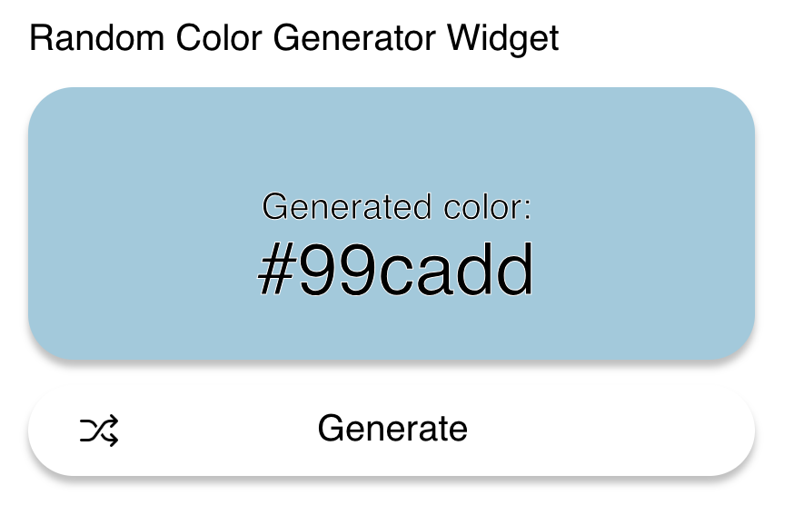

# Simple color generator widget

## Preview

## Core features

1. The "generate" CTA has a hover behavior and changes style.
2. When clicking on the button, it calls the randomColor() function and generated a random HEX code.
3. The color of the 
 container changes according to the HEX code that has been generated.

## Additional features

- Added a Hue selector that allows you to generate a random color with a particular hue.

## Notes

- Clean and simple UI designed and exported with Figma
- Reused randomColor package from the Node.js
